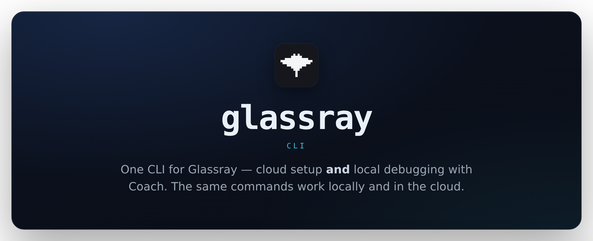
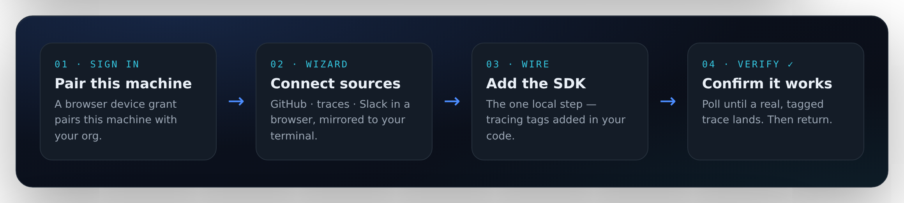

<div align="center">



<p>
  <a href="#quickstart">Quickstart</a> ·
  <a href="#commands">Commands</a> ·
  <a href="https://glassray.ai/docs/cli/setup">Docs</a> ·
  <a href="https://glassray.ai/docs/coach/overview">Local Coach</a> ·
  <a href="https://www.npmjs.com/package/@glassray/cli">npm</a>
</p>

<p>
  <a href="https://www.npmjs.com/package/@glassray/cli"></a>
  
  <a href="./LICENSE"></a>
</p>

</div>

<!--
  Demo: this is where a recorded GIF of `glassray setup` belongs — the whole flow
  ending on a verified trace. Record one and drop it in, centered, e.g.:
  <p align="center"></p>
-->

Run `glassray setup` in your agent's repo and go from nothing to a **verified, watched
account**. It's a launcher: it signs you in, hands the connecting — GitHub, traces, Slack — to a
quick **browser wizard**, mirrors each step back to your terminal, then wires the tracing SDK
into your code locally. It does the thing most setup tools skip: it confirms a real,
correctly-tagged trace has landed in Glassray **before it returns**.

The same binary also runs the local, try-before-cloud
[Coach](https://glassray.ai/docs/coach/overview) (`glassray start` plus the data verbs). Local
and cloud are the same commands in two environments.

## Why the CLI

- **It sets everything up for you.** Point it at your agent's repo and it wires the tracing SDK,
  connects your sources, and tags your traces — the whole onboarding in one command.
- **Then it verifies — it doesn't hope.** Setup won't return until a real, correctly-tagged trace
  has landed in Glassray. So "done" means _watched_, not just configured.
- **It's careful with your code.** Your source never leaves the machine — the CLI edits files
  locally and talks to the API only over HTTPS. And when it runs Claude Code for you, that session
  is **sandboxed**: it may only install the `@glassray` package scope and can **never** `git commit`
  or `git push` — hard-blocked, so changes land uncommitted in your working tree for you to review.
- **One binary, two environments.** The same tool runs Coach locally for try-before-cloud
  debugging — then the same commands work against your cloud account.

## How setup runs

`setup` is a launcher, not a terminal orchestrator: it opens the browser wizard, polls until you
finish, then does the one local step — wiring the SDK — and the verify gate.

<p align="center">
  
</p>

First-time onboarding needs a browser; re-runs skip the wizard once it's done, so _"just run it
again"_ is the universal recovery, with no duplicate orgs or sources.

## Quickstart

Requires **Node 20.6+**. Run it once, or install it:

```sh
npx @glassray/cli setup            # no install; runs the whole onboarding flow

npm i -g @glassray/cli             # or install it, for `glassray` on your PATH
glassray setup
```

Nothing of your source code transits Glassray. The CLI edits files locally (or hands a prompt to
your own Claude Code) and talks to the API only over HTTPS.

## Commands

Run `glassray --help` for the branded reference, or `glassray <command> --help` for flags.

| Set up (cloud)               | What it does                                                                              |
| ---------------------------- | ----------------------------------------------------------------------------------------- |
| `glassray setup`             | Launcher: sign in → wizard (GitHub · traces · Slack) → wire the SDK → verify               |
| `glassray login` / `logout`  | Pair this machine (browser device grant), or clear the stored credential                  |
| `glassray whoami`            | Which org and user the active key resolves to                                             |
| `glassray detect`            | Inspect the repo: framework, tracing, provider keys                                       |
| `glassray connect <target>`  | Open a source's settings page: `otlp` · `langsmith` · `langfuse` · `posthog` · `slack` · `github` |
| `glassray instrument`        | Add the SDK + tags; offers to run Claude Code (headless, live progress; never commits/pushes) |
| `glassray verify`            | The exit gate: poll until a real trace lands                                               |
| `glassray status`            | Cloud account summary: sources, health, GitHub/Slack                                      |

**Local Coach.** `glassray start` runs the server; the data verbs — `traces`, `flows`, `evals`,
`deviations`, `experiments`, `fix`, `runs`, `stats`, `usage` — talk to it on `127.0.0.1:5899` and
print the API's JSON **verbatim**. The loop verbs (`pull` / `push` / `run` / `compare` / `check` /
`link`) run the whole harness loop from the same binary.

| Manage                     | What it does                                                    |
| -------------------------- | -------------------------------------------------------------- |
| `glassray init`            | Install the agent skill (`.claude/` + `.agents/`)              |
| `glassray mcp add\|remove` | Register the cloud MCP server in `.mcp.json`                   |
| `glassray token`           | Print the stored org key on stdout (the `gh auth token` pattern) |
| `glassray doctor`          | Local and cloud health checks                                  |
| `glassray upgrade`         | How to self-update                                             |

## Global flags and environment

| Flag               | Env                     | Meaning                                                                      |
| ------------------ | ----------------------- | ---------------------------------------------------------------------------- |
| `--endpoint <url>` | `GLASSRAY_APP_URL`      | Target deployment (default `https://app.glassray.ai`). `GLASSRAY_ENDPOINT` is a deprecated fallback (reserved for the SDK's ingest endpoint). |
| `--api-key <key>`  | `GLASSRAY_TOKEN`        | Org key for CI/headless. Precedence: flag, then env, then stored credential. |
| `--json`           | (none)                  | Machine output on stdout (status chrome stays on stderr).                    |
| `--port <n>`       | `GLASSRAY_PORT`         | Local Coach port (default `5899`).                                           |
| `--no-telemetry`   | `GLASSRAY_NO_TELEMETRY` | Opt out of best-effort run telemetry.                                        |
| `--debug`          | (none)                  | Verbose output and stack traces.                                             |

Other environment variables: `GLASSRAY_AUTH_API` overrides the authentication-service base
(defaults to `https://auth-api.glassray.ai`); `XDG_CONFIG_HOME` relocates the config directory;
`GLASSRAY_NO_UPDATE_CHECK` (also honors `NO_UPDATE_NOTIFIER` and `CI`) disables the npm update
check.

**Output discipline.** stdout is data (JSON and cards); stderr is status. Exit codes: `0` ok,
`1` handled failure, `2` a dependency was unreachable. Non-TTY sessions never prompt, and every
browser hand-off also prints its URL, so SSH and headless runs never get stuck.

## Where credentials live

The org key is stored at `~/.config/glassray/credentials.json` (file `0600`, directory `0700`,
honoring `XDG_CONFIG_HOME`), keyed by endpoint so one machine can pair with several deployments.
`glassray logout` clears it locally; rotate or revoke server-side in the dashboard.

> **`GLASSRAY_TOKEN` vs `GLASSRAY_API_KEY`.** `GLASSRAY_TOKEN` is the CLI's own **org key** (it
> carries `mcp:read` + `mcp:write` and resolves your account). It is deliberately **distinct**
> from `GLASSRAY_API_KEY`, the SDK's per-source **ingest key** that the CLI can write into your
> repo's env file (`.env.local` or `.env`, gitignored — `setup` shows it and asks first), so a
> shell that exports one can never be mistaken for the other. The CLI _reads_ `GLASSRAY_TOKEN`; it
> only ever _writes_ `GLASSRAY_API_KEY`.

The key is **never written into `.mcp.json`**, since repos commonly commit that file. `glassray
mcp add` writes the Authorization header as `Bearer ${GLASSRAY_TOKEN}` (your AI client expands
`${VAR}` from the environment at load time), so `.mcp.json` is safe to commit. Export the key
for your client with:

```sh
export GLASSRAY_TOKEN="$(glassray token)"
```

## Privacy and telemetry

No source code leaves your machine. Run telemetry is coarse phase/step events (never keys, code,
or URLs) and strictly fire-and-forget: it honors `--no-telemetry` / `GLASSRAY_NO_TELEMETRY`,
never blocks a command, and never throws. The npm update check sends only the package name in a
single HTTPS request (opt out with `GLASSRAY_NO_UPDATE_CHECK=1`).

## Docs

- **[Set up with the CLI](https://glassray.ai/docs/cli/setup)**: the onboarding flow, worked end to end
- **[Command reference](https://glassray.ai/docs/cli/reference)**: every command and global flag
- **[Local Coach](https://glassray.ai/docs/coach/overview)**: the try-before-cloud loop
- **[DEVELOPMENT.md](./DEVELOPMENT.md)**: contributing, layout, publishing

## License

[MIT](./LICENSE) © Glassray
